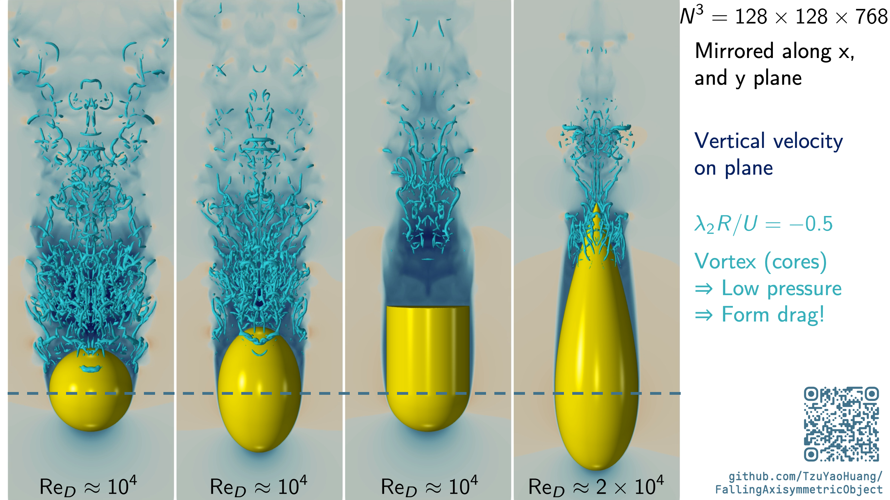

# FallingAxisymmetricObject

[](figure/FallingObjectSimulation.mp4)

This repository is for Falling object demonstration in MT2461-25 in TU Delft lectured by Professor Gabriel Weymouth.
The responsible TA is Manuel Cabral (Physics demo) and Tzu-Yao Huang (simulation scripts).

## File structures

The file for 3D printer are stored in [ThreeD_Object](ThreeD_Object/) in STL format.
The object is sliced to half for simplicity.

Related Julia and Python files are stored in [scripts](scripts/).

## How to run julia

First install julia following the [official steps](https://julialang.org/install/).
```bash
$ curl -fsSL https://install.julialang.org | sh
```

Second, clone this repo to some local folder
```bash
$ git clone https://github.com/TzuYaoHuang/FallingAxisymmetricObject.git
```

Third, go to directory `scripts/` and initialize the environment
```bash
$ cd FallingAxisymmetricObject/scripts
$ julia --project -E 'using Pkg; Pkg.add(url="https://github.com/weymouth/BiotSavartBCs.jl.git", rev=true); Pkg.instantiate()'
```

Forth, run the simulation!
```bash
$ julia --project -t auto Falling.jl
```

Then there will be `.pvd` files generated at the end of the simulation. You could use ParaView to view the result!
The drag coefficient plot comparison and data are also under directories `figure/`.